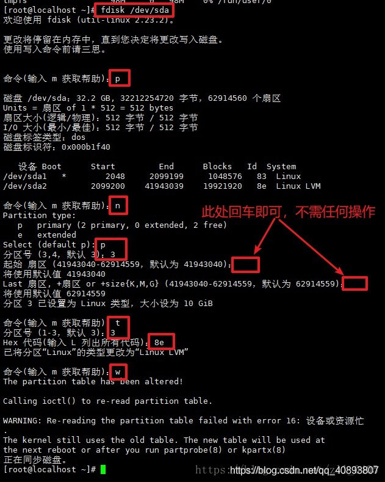
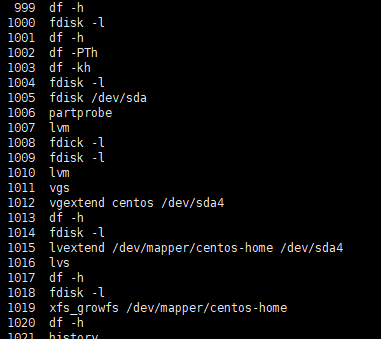
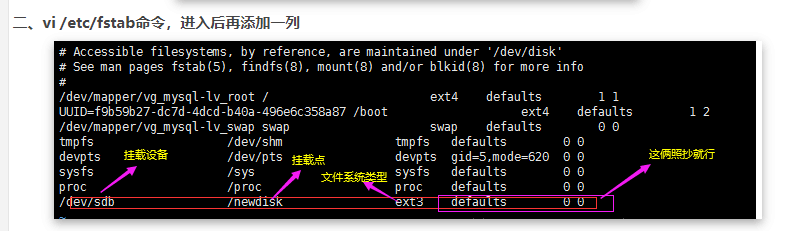

## 虚拟机里给 centos7 扩容

首先，编辑设置，增大磁盘空间：

然后，系统里执行 `df -h` 和 `fdisk -l` 命令，这时候还不能看到增加的容量，需要进行以下操作：

```bash
fdisk /dev/sda
```



命令解释：

n 添加新分区

p 自定义分区

分区号默认选择4（已有/dev/sda1，/dev/sda2）

选择默认分区起始位置

选择默认分区结束位置

t 更改分区信息（这里我们主要修改分区类型为Linux LVM）

w 将分区信息写入磁盘

执行 partprobe命令用于将磁盘分区表变化信息通知内核，并请求操作系统重新加载分区表，此方法可以不用重启系统：

```bash
partprobe
```

扩展vg（这里我默认是4，系统原本已有3个分区）：

```bash
# 格式化分区
# mkfs -t ext3 /dev/sda4
# 创建PV，将/dev/sda4分区格式化为物理卷
pvcreate /dev/sda4
# 查看组名称 (教程是cl，我这里是centos)
vgs
# 把sda4加入到LVM组中，为centos卷组增加物联卷/dev/sda4
vgextend centos /dev/sda4
# 扩展lv。将硬盘添加至根分区，完成卷扩容 (这里df -h找到我要扩容的分区叫/dev/mapper/centos-home)
lvextend /dev/mapper/centos-home /dev/sda4
# xfs在线扩容。文件系统扩容
xfs_growfs /dev/mapper/centos-home
# 再次确认状态 df -h，扩容生效
```

我的实操过程记录：



## centos7 进入安全模式修改密码

```bash
1.重启--reboot
2.在倒数秒数时，按任意键
3.按e键
4.找到Linux16这行，到此结尾(按end)
5.空格，输入 rd.break  console=tty0
6.按ctrl+x
7.输入mount -o remount,rw /sysroot
8.chroot /sysroot
9.passwd root     (输入密码2次)
10.touch /.autorelabel 
11.输入2次 exit
```

## 简易搭建局域网内部dns服务器

```dockerfile
FROM centos:7
 
RUN yum install -y bind-utils bind bind-devel bind-libs && \
    yum clean all && \
    rm -rf /var/cache/yum/*

COPY /etc/named.conf
COPY /etc/named.rfc1912.zones
RUN cp -a /var/named/named.localhost /var/named/yonatan.io.zone

EXPOSE 53/udp 53/tcp

ENTRYPOINT ["/sbin/entrypoint.sh"]

CMD ["/usr/sbin/named"]
```


## 服务器时间同步

1.编写被定时执行的脚本

vim /usr/local/bin/ntpdate_timesync.sh

写入如下内容

```bash
#!/bin/bash

step=1

for (( i=0; i<60; i=(i+step) )); do
  ntpdate -u ntp.api.bz >> /var/log/ntpdate_timesync.log 2>&1
  sleep $step


exit 0
```

2、对脚本实现定时执行管理：

```bash
* * * * * bash /usr/local/bin/ntpdate_timesync.sh
```

## centos 查询安装文件

```shell
rpm -qa xxx
```

## linux重启自动挂盘


