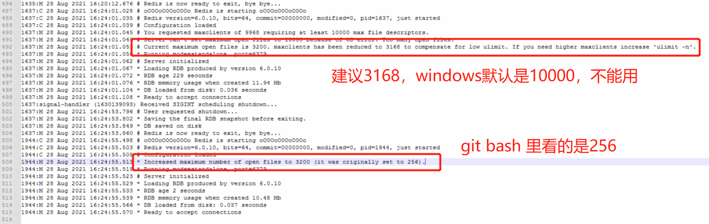
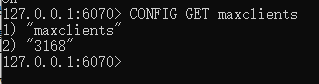
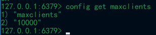

## 找出线上Redis连接数异常IP（连接数高）

```bash
redis> info clients
redis> client list

# 保存client list到文件
echo client list | redis-cli -h 192.168.0.59 -p 6379 -a 123456 > client-list

# 从文件中找出连接数前5的IP
cat client-list | awk '{print $2}' | awk -F "[=:]" '{print $2}' | sort | uniq -c | sort -k1,1nr | head -5
```

> 参考：https://jishuin.proginn.com/p/763bfbd3624d

## Windows编译安装Redis 6.0

!> 该方法踩坑，详情见 [连接数不够导致redis假死](#连接数不够导致redis假死)

用MSYS2来提供gcc和make环境

先下载MSYS2，清华源  https://mirrors.tuna.tsinghua.edu.cn/msys2/distrib/x86_64/

下载解压，然后需要给pacman（msys2的软件管理器）换一下国内源（/etc/pacman.d/）https://mirrors.tuna.tsinghua.edu.cn/help/msys2/

pacman -Sy

pacman -S gcc make

cd /d/redis-6.2.3/

> 6.2 版本 编译失败：未知的类型名 ‘Dl_info’
>
> /usr/include/dlfcn.h
>
> 找到 Dl_info定义的地方，删除上面的 `#if` 和下面的 `#endif` 两行【49，61行】

make install PREFIX=/d/msys64/tmp

复制 msys-2.0.dll, redis.conf 和 sentinel.conf 到 tmp

借助 nssm 制作成服务

教程出处：https://blog.csdn.net/oooo2316/article/details/107545700


编译redis报错/deps/hiredis/libhiredis.a解决
进入源码包目录下的deps目录中执行
```bash
make lua hiredis linenoise hdr_histogram
```
https://blog.csdn.net/weixin_34137799/article/details/91735286


经测试, msys, cygwin 在我的电脑上16G剩余内存8G的环境, 并发到55就崩了

(winserver 2016 8G, 实际可用2G环境下测试, 并发撑不到40)

Why can Redis only have 124 connections in cygwin64？

https://github.com/redis/redis/issues/8330

github 上有人用过 visual Studio 2022 去编译, 性能会好点, 但还是有些差距

测试过最好的是这个: https://github.com/tporadowski/redis
现在是2022-10-25, 目前更到 5.0.14.1, 期待快点更新到6.2

最后这次又遇到这个问题, 是因为扫描出4.x和6.x某些早期版本有漏洞, 所以想升级, 以及同一天也有人提出6.x长时间运行会假死


> Cygwin编译redis windows ~~【未实践】~~  (实践结果也是连接数小, 扛不住并发)
>
> https://blog.csdn.net/sunbcy/article/details/120323975
>

## 连接数不够导致redis假死

问题分析：升级了 redis 服务。该 redis 6.x 是 wdinwos 下编译的，读取不到正确最大连接数，连接数不够导致假死

```bash
# 开启日志，便于观察
logfile "D:/redis/redis.log"
loglevel notice  (生产模式推荐)
# 网络IO线程
io-threads-do-reads yes
io-threads 4  (低于CPU核数)
# 客户端最大连接数
info clients
CONFIG GET maxclients

3200-32  (受系统限制，redis增大配置也无效)
10000-32
```


wdinwos下编译的6.x版本redis：



wdinwos下编译的4.x版本redis：



regedit

计算机\HKEY_LOCAL_MACHINE\SOFTWARE\Microsoft\Windows NT\CurrentVersion\Windows

GDIProcessHandleQuota  2710(十六进制)/10000(十进制)

USERProcessHandleQuota  2710(十六进制)/10000(十进制)

[参考java redis 连接池 假死](https://www.jianshu.com/p/c4a75ca20abe)

---

首次排查分析原因：

~~该应用是用 egg.js 写的，使用 --workers=2 减少进程，启动速度快了很多。该程序是窗口运行的，观测到日志已经卡住了，合理猜测前面有未结束的进程还在后台占用连接数，再启动程序就因超了连接数而超时。~~

同时发现代码有待优化，遍历海量数据不能用 keys 应该用 scan

## redis：max number of clients reached

redis连接数超了，查看最大连接数：

```bash
CONFIG GET maxclients
```

## redis：ERR The operating system is not able to handle the specified number of clients

linux解决方法（未试验）：

https://blog.csdn.net/William0318/article/details/104682854

```bash
cat /proc/pid/limits
vim /etc/security/limits.conf
(略)
```

## 在 docker arm 容器内编译 redis 踩坑记录

### 第①个：lower value of 128

详细：WARNING: The TCP backlog setting of 511 cannot be enforced because /proc/sys/net/core/somaxconn is set to the lower value of 128.

- 警告描述：不能设置tcp的堆积为511，因为/proc/sys/net/core/somaxconn的值为128太低。
- 解决方法

```sh
#在/etc/sysctl.conf中添加如下
net.core.somaxconn = 2048
#然后在终端中执行
sysctl -p

#或者一行命令,等号左右不能有空格
sysctl -w net.core.somaxconn=2048
```

行不通，报错：`sysctl: setting key "net.core.somaxconn": Read-only file system`

解决：

docker run 时使用 -sysctl net.core.somaxconn=1024

或者创建容器时, 加上--privileged即可

### 第②个：overcommit_memory is set to 0! 

详细：WARNING overcommit_memory is set to 0! Background save may fail under low memory condition. To fix this issue add 'vm.overcommit_memory = 1' to /etc/sysctl.conf and then reboot or run the command 'sysctl vm.overcommit_memory=1' for this to take effect.
> 警告 overcommit_memory 设置为 0！ 在内存不足的情况下，后台保存可能会失败。
> https://blog.csdn.net/m0_62089210/article/details/127004090

修改 /etc/sysctl.conf

```bash
sysctl -w vm.overcommit_memory=1
```

### 第③个： ignore-warnings ARM64-COW-BUG

Redis启动失败报错：Redis will now exit to prevent data corruption. Note that it is possible to suppress this warning by setting the following config: ignore-warnings ARM64-COW-BUG

**报错提示的是内核不对**, 可能无法正常保存redis的数据

解决：根据提示在配置文件redis.conf 添加取消这最后一条注释： ignore-warnings ARM64-COW-BUG


## Redis: 查看占用内存

```bash
redis-cli
> info

找到
# Memory
used_memory:705656
used_memory_human:689.12K

计算得出：705656/1024/1024 = 0.6M,当然直接读_human就好了
```

## Redis: `<jemalloc>: Unsupported #system page size`

背景：在uos上运行项目集成镜像，内置redis服务启不来。这个镜像的redis是在64位树莓派上编译的，系统是Raspbian（基于debian）

原因：在arm64环境下，centos的pagesize是64k，ubuntu的pagesize是4k，一般来说64k下编译的镜像是可以在小于或者等于64k的环境下运行的，但如果是在4k下编译的镜像，那么是不能在pagesize大于4k的环境下运行的。这个是jemalloc造成的。如果在编译构建镜像时使用libc就不会有这种问题。

在构建的Dockerfile的RUN make xxxx指令前加上ENV USE_JEMALLOC no即可使得编译redis时不使用jemalloc。

当然，jemalloc在某些场景下性能要优于libc，这个在选择用何种方式编译redis时，需要考虑清楚。

```bash
# 查看内存页面大小
getconf PAGESIZE

uos的是65536，是64k，而我们这边环境都是4k
```

解决思路：

1. 在arm64 centos机器中重新编译redis可执行文件 ~~（或者修改pagesize为64k）~~

2. 将编译好的文件复制到容器中
3. 重新commit成一个新镜像发布

> 阅读：
> 
> [大内存时代——为什么PageSize仍不建议选择16KB或64KB？其实我们有更好的选择](https://zhuanlan.zhihu.com/p/269906327)
