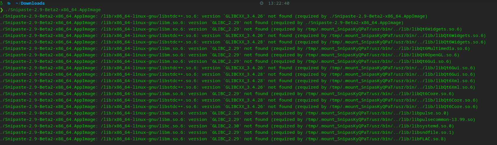
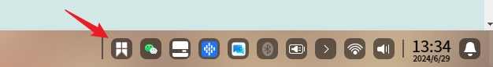
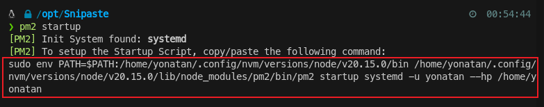

{docsify-my-updater date:2024-06-29}

# Deepin 20.9 安装 Snipaste 截图工具

Snipaste Linux 公测版 (AppImage): v2.9-Beta (2024.04.24)，在 Deepin 20 上双击执行没有反应，说下我的解决办法。

下载地址：https://zh.snipaste.com/download.html


## 思路

在终端中运行能看到错误输出，失败的原因是 glibc 版本太低，运行结果：



这是因为程序需要 glibc 库 2.29 版本，而 deepin 20.9 自带的是 2.28 版本。

```bash
# 查看系统的 glibc 版本
ldd --version
```

很多文章会教如何升级 glibc，但这风险很大，glibc 是很重要的基础库，贸然操作非常容易造成系统损坏。

一般对于这类问题可操作的思路是把 AppImage 解包，找到存放依赖的目录修改依赖引用，或是从源码重新编译一个适用版本。不过这些操作都过于复杂。

```bash
# 解包 AppImage
./Snipaste-2.9-Beta2-x86_64.AppImage --appimage-extract
cd squashfs-root
# 在 /usr/lib 目录下补充依赖
./AppRun
```

我在 deepin 论坛找到了更简单的解决办法。可以先尝试使用社区里分享的一个解决 glibc 版本问题的小工具：https://gitee.com/spark-store-project/additional-base-lib，可能有奇效。


## 解决办法

1. 安装 Additional Base Lib 附加基础库工具

```bash
sudo apt install additional-base-lib
```

2. 使用 ablrun 启动截图工具




3.现在已经可以使用截图工具了，但是关闭终端后程序会被退出，而且每次这样启动也很繁琐。因此除了解决后台运行，还要设置成开机启动。实现开机启动的工具方法有很多种，例如 rc.local、systemed、supervisor，我用的是 pm2 ，它提供了很方便的命令：

首先写一个启动脚本：

```bash
# start.sh
#!/bin/bash
cd $(dirname $0)
ablrun ./Snipaste-2.9-Beta2-x86_64.AppImage
```

建议把程序和脚本放到 /opt 目录下：


pm2 使用步骤：

（1）把 pm2 服务设置成开机启动。先运行 `pm2 startup `命令，再运行返回的命令



可以看出这条命令帮我生成了pm2 的 systemd 配置文件，并设为开机启动


（2）使用 pm2 启动截图工具

```bash
# 首次启动指定名称为 snipaste，后续可以用 pm2 [start|stop|restart] snipaste 进行管理
pm2 start --name snipaste start.sh
# 保存, 否则重启后丢失
pm2 save
```

（3）常用命令

```bash
# 查看运行情况
pm2 list
pm2 log snipaste

# 重启
pm2 restart snipaste
# 关闭
pm2 stop snipaste
# 启动
pm2 start snipaste
```

目前已知该版本的 Snipaste 有个问题，右下角托盘只有首次右键可以打开菜单，后面如果不重启程序则不能正常显示右键菜单。
